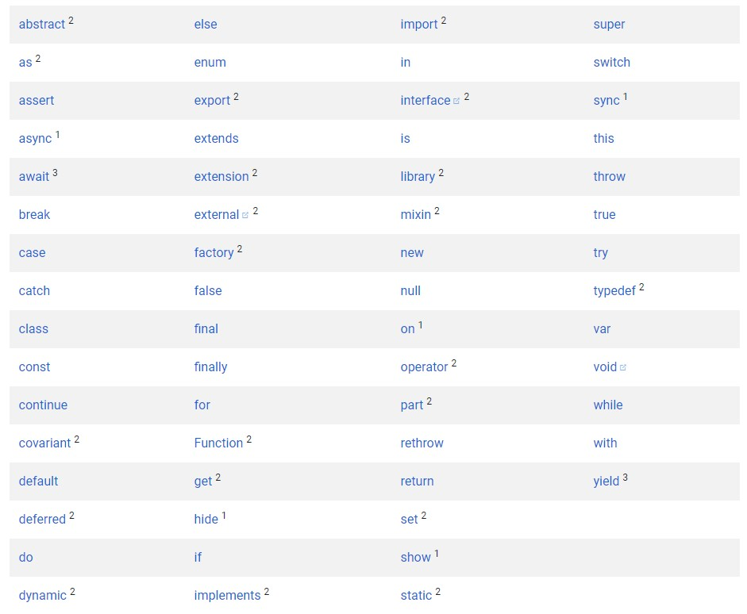

# Dart 

Dart is a relatively new programming language that was developed by Google. It is open source, object oriented, strongly typed, and class defined.

## Features of Dart

- It is easy to learn when you have some background of Java, C#, or JavaScript because the syntax of Dart is very similar to those languages.
- It has a general purpuse due to it can be used for client-side and server-side. 

## Important concepts

- Everything you can place in a variable is an object, and every object is an instance of a class. 
- All objects inherit from the [Object](https://api.dart.dev/stable/2.10.4/dart-core/Object-class.html) class.
- Dart is strongly types, however type annotations are optional due to Dart can infer types. When you want to explicitly say that no type is expected, you should use the special type *dynamic*  instead of letting inference fail.
- Dart supports generic types like <T>.
- Dart supports top-level functions(), functions tied to a class or object(static and instance methods, respectively), and functions within functions (nested or local functions).
- Dart supports top-level variables, as well as variables tied to a class or object(static and instance variables). Instance variables are also known as fields or properties.
- Dart does not support the keywords *public*, *protected*, and *private*. If you want to declare an identifier as private for a library, you need to start it with an underscore(_).
- 

## Keywords

You can read more about this subject [here](https://dart.dev/guides/language/language-tour#keywords).

## Syntax

### Comments 

Dart suports the following types of [comments](https://dart.dev/guides/language/language-tour#comments):
- **single-line comments** 

    <code>
        // This is a single-line comment
    </code>

- **multi-line comments**

    <code>
        /* This  
         * is   
         * a  
         * multi-line  
         * comment  
         */ 
    </code>

- **documentation comments**

    <code>
        /// This  
        ///  
        /// is  
        /// a  
        /// documentation  
        /// comment 
    </code>

### Variables

A variable stores a reference to an Object. 
The syntax used to declare and initialize a variable is:

    type varName = value;

Uninitialized variables are null by default - including numbers.

If the value of a variable will not change, you should use ***final*** or ***const***, either instead of ***var*** or in adition to a type. A final variable can be set only once; a const variable is implicitly final, and a compile-time constant. 

A final top-level variable is initialized the first time it is used.

Instance variables can be final but not const. Final instance variables must be initialized before the constructor body starts — at the variable declaration, by a constructor parameter, or in the constructor’s initializer list.

If the const variable is at the class level, mark it ***static const***.

Although a final object cannot be modified, its fields can be changed. In comparison, a const object and its fields cannot be changed because they are immutable.

## Build-in types

| Type | Description |
|:----:|-------------|
|[*Numbers*](https://dart.dev/guides/language/language-tour#numbers)|  Numbers can be declared as [**int**](https://api.dart.dev/stable/2.10.4/dart-core/int-class.html) or [**double**](https://api.dart.dev/stable/2.10.4/dart-core/double-class.html) which are subtypes of [**num**](https://api.dart.dev/stable/2.10.4/dart-core/num-class.html). The num type includes properties, operators and methods ehat make eassier to work with numbers. However, if num ot its subtypes do not have what you need, the [**dart:math**](https://api.dart.dev/stable/2.10.4/dart-math/dart-math-library.html) library might.|
|[*Strings*](https://dart.dev/guides/language/language-tour#strings)| A Dart string is a sequence of UTF-16 code units. You can use either single ( ' ' ) or double ( " " ) quotes to create a [**String Object**](https://api.flutter.dev/flutter/dart-core/String-class.html).|
|[*Booleans*](https://dart.dev/guides/language/language-tour#booleans)|To represent boolean values, Dart has a type named **bool**, which can have only two values: *true* and *false* - both compile-time constants.|
|[*Lists*](https://dart.dev/guides/language/language-tour#lists)|In Dart, arrays are [**List objects**](https://api.dart.dev/stable/2.10.4/dart-core/List-class.html), so most people call them lists. Dart list literals look like JavaScript array literals.|
|[*Set*](https://dart.dev/guides/language/language-tour#sets)|A set in Dart is an unordered collection of unique items. Dart support for sets is provided by set literals and the [**Set type**](https://api.dart.dev/stable/2.10.4/dart-core/Set-class.html).|
|[*Maps*](https://dart.dev/guides/language/language-tour#maps)|In general, a map is an object that associates keys and values. Both keys and values can be any type of object. Each key occurs only once, but you can use the same value multiple times. Dart support for maps is provided by map literals and the [**Map type**](https://api.dart.dev/stable/2.10.4/dart-core/Map-class.html).|
|[*Runes*](https://dart.dev/guides/language/language-tour#runes-and-grapheme-clusters)|In Dart, [*runes*](https://api.dart.dev/stable/2.10.4/dart-core/Runes-class.html) expose the Unicode code points of a string. As of Dart 2.6, use the [characters package](https://pub.dev/packages/characters) to view or manipulate user-perceived characters.|
|[*Symbols*](https://dart.dev/guides/language/language-tour#symbols)|A [Symbol object](https://api.dart.dev/stable/2.10.4/dart-core/Symbol-class.html) represents an operator or identifier declared in a Dart program. You might never need to use symbols, but they’re invaluable for APIs that refer to identifiers by name.|

